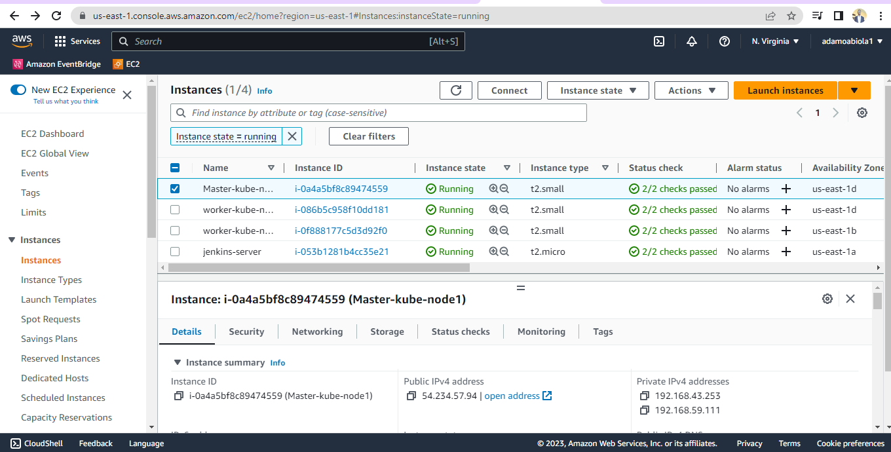
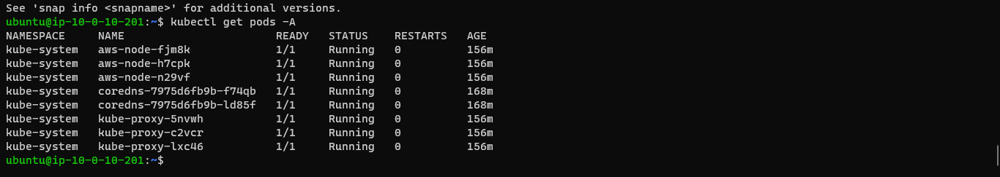

# To run this terraform code, follow the steps listed below carefully.
# Note : The code have been provision to run on AWS

# Step 1: create a bucket and keypair on AWS that matches your terraform values

# Step 2: cd into terraform-modules directory and run these commands on your terminal
## terraform init
## terraform validate
## terraform plan
## terraform apply --auto-approve
## your output should look like the image below

 

# Step 3: pick your ip from the terraform output and add :8080 i.e http://54.***.**.*62:8080/ to set up your jenkins-pipeline. Create a Jenkins Server with all the dependencies, libraries and packagies needed.
## A successful output should look like the image below

 

# Step 4: set up your github and aws Iam credentials use the jenkins-continuous-pipeline module to run your first build.
# Note it takes about 15 - 20mins for your cluster to build. Your eks console should display a similar image to this.

 

# Also check your ec2 dashboard for similar image

 

# Use kubectl get nodes and kubectl get pods to view the state of your nodes and pods.

 

 

# 5. Test that the application is running, your default site should be welcome to nginx.

# 7. update and upgrade the nodes then install helm chart to deploy your apps on the nodes. i.e myapp below

 

 

 

## 6. Destroy infrastructure using terraform destroy --auto-approve.

